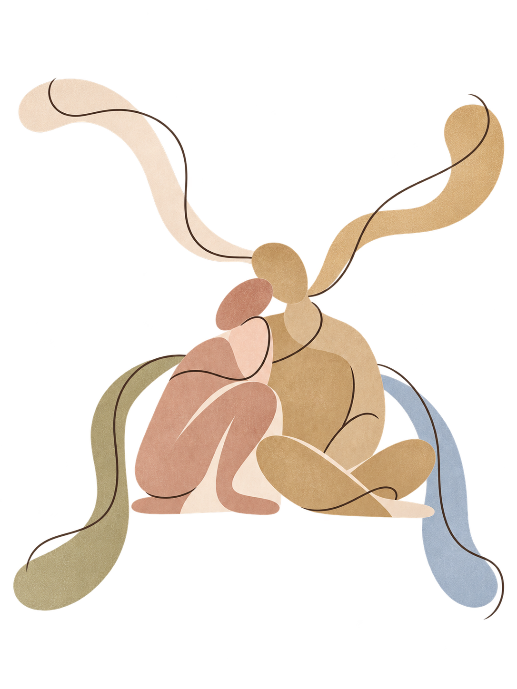
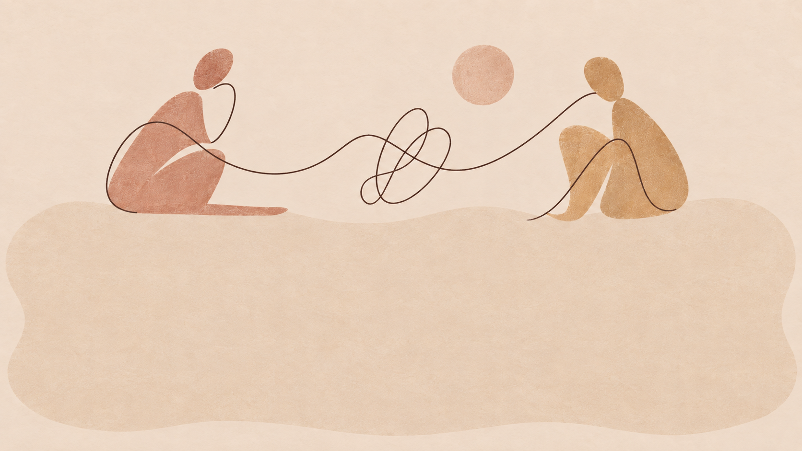

# Website Copy — Couples Therapy MA

Captured from [https://www.couplestherapyma.com](https://www.couplestherapyma.com/) on 2026-09-14.

This is a route-by-route content inventory. Markdown heading levels mirror the source HTML; plain uppercase lines are source kickers/eyebrows rather than inferred headings. CTA destinations, form labels/placeholders, page metadata, and image placements are included so the site can be rebuilt faithfully. Images use relative links into `../assets/`; where the source omitted alt text, the placeholder explicitly identifies that omission and retains the source filename.

## Global navigation

- Site title: [Natalie Gaida | LMFT](/)
- [Home](/)
- [About](/about)
- Services
  - [Desire & Intimacy](/sexless-marriage)
  - [Communication & Conflict](/communication-conflict-therapy)
  - [Affair Recovery](/infidelity-affair-recovery)
  - [Parenting Alignment](/parenting-alignment-therapy)
  - [Discernment Therapy](/discernment-therapy)
- [Contact](/contact)

## Global footer

Copyright 2026

---

## Route: `/` — Home

**Sitemap alias:** `/home` serves this same homepage content.

**Source URL:** https://www.couplestherapyma.com/

**Page title:** Natalie Gaida | LMFT | Rebuild Connection Today

**Meta description:** Experienced couples therapy in Needham, MA, with virtual options throughout Massachusetts. Rebuild trust, communication, and intimacy to strengthen your relationship.

**Canonical:** https://www.couplestherapyma.com

# Couples Therapy in Needham, MA

Virtual Therapy Services throughout Massachusetts

## Close the Gap. Come Back to Each Other

#### Couples Therapy for Partners Ready to Rebuild Desire and Connection

[BOOK A FREE CONSULTATION](/contact)

COUPLES THERAPY THAT ACTUALLY WORKS

## Get Unstuck, and Feel Like a Team Again

Most couples who reach out to me aren't in crisis, they're just tired. Tired of having the same fight, tired of feeling like roommates instead of partners, tired of wondering whether the distance between you is something you can fix or something you're stuck with. Maybe you've read the books, tried talking it out on your own, and you're still landing in the same place. That's not a sign your relationship is one of the ones that doesn't make it. It's usually a sign you're missing the right tools for exactly what's happening between you, not more effort, not more good intentions, but an approach actually built for your relationship. You don't need another list of communication tips you've already tried.

You need someone who can see the actual pattern you're stuck in and help you build a way out of it together. That's what this work is. Not generic advice. A way back to each other that fits the two of you specifically.

## You're Choosing to Keep the Peace, Even When It's Costing You the Closeness You Actually Want

∞ You have the same fight over and over, just about different things each time

∞ You feel more like co-parents or roommates than partners

∞ One of you isn't sure this relationship should continue

∞ Trust was broken, and you don't know how to rebuild it

∞ You want to feel wanted by each other again, not just functional

[BOOK A FREE CONSULTATION](/contact)

#### MEET NATALIE GAIDA, LMFT

## Couples Therapist in Needham, MA

Virtual Therapy Services throughout Massachusetts

Hi, I'm Natalie. I help couples who are stuck in the same repeated fight, or who've started to feel more like roommates than partners, rebuild real trust and communication so they can feel like a team again, want each other without walking on eggshells, and build a relationship that actually fits who they are, not a generic script for what a relationship is supposed to look like.

This work is personal to me. I don't believe most couples are broken, I believe they're missing the right tools for exactly what's happening between them, and that once they have those tools, real change happens fast. That belief shapes how I show up in the room: I'll tell you what I see, in a way that feels like I'm on your team the whole time.

I believe in relationships where both people feel like partners again, not roommates, not opponents keeping score. Where hard conversations get easier instead of scarier, and where you both know exactly how to find your way back to each other, no matter what you're up against.

[MORE ABOUT ME](/about)

Affair Recovery For couples after an affair, tired of "rebuilding trust" as a vague idea. I'll tell you plainly what that actually takes.

[Learn more ->](/infidelity-affair-recovery)

Discernment Therapy For couples where one of you isn't sure this should continue. A short, structured process built to get you a real decision.

[Learn more ->](/discernment-therapy)

Communication & Conflict For couples who've tried the scripts and still end up in the same fight. I'll name the pattern underneath the words.

[Learn more ->](/communication-conflict-therapy)

Desire & Intimacy For couples navigating different levels of desire, ready to feel wanted by each other again, not just accommodated.

[Learn more ->](/sexless-marriage)

Parenting Alignment For couples who are fine with each other until a parenting decision lands on the table, then suddenly aren't.

[Learn more ->](/parenting-alignment-therapy)

Testimonials with Couples’ Permission

## "Working with Natalie has truly been one of the best decisions we've made for our relationship. After being together for over 12 years, we felt stuck in the same cycles and patterns, especially when it came to physical intimacy and communication. She helped us slow down, look deeper, and explore the root causes instead of just focusing on the surface issues." — A & A

— A & A

## "Natalie is a gifted therapist. She has a way of getting to the root of the problem without offending either party. She taught us to communicate, rather than going around in circles repeating the same complaints."

— K & F

## “Clear communication and rigorous analysis distinguished the team from prior vendors we engaged.”

Recent Client

## "Natalie is a master at creating a space where both partners feel heard and supported, while also gently challenging us to grow. She helps identify patterns, reactions, and blind spots with clarity and compassion."

— A & S

## "Rather than letting us fall back into old habits, she encouraged us to stay curious, communicate openly, and truly work as a team. She helped us feel hopeful again and gave us practical ways to strengthen our relationship and intimacy."

— A & A

## "She uses RLT techniques, and recommends books and articles that are beneficial for our specific needs. She is compassionate, friendly, and able to keep a session light hearted when it might otherwise be tension filled. We highly recommend Natalie as a couples therapist."

— K & F

## "She took pauses during our sessions, truly processing what was being discussed and offering such insightful thoughts and suggestions. Anyone out there would be so incredibly lucky to work with Natalie, she is an absolute gem."

— A & Z

## "We found our sessions with Natalie to be invaluable. Natalie helped us to communicate better and to remember why we fell in love with each other in the first place. Natalie is very approachable and always made us feel comfortable."

— B & V

## "Natalie is someone we were both able to establish a rapport with quickly, which helped us open up and trust the process with her. She is friendly, kind, and open, in a way that makes the sessions feel less formal and more of a collaboration."

— C & K

## "Our communication greatly improved and we started to remember to spend more time enjoying each other's company and less on the demands of day to day life. It has made a wonderful difference in our relationship."

— C & K

## "We especially appreciated Natalie's quickness to introduce new strategies, always suggesting additional resources and encouraging exploration of concepts between sessions. We are truly grateful for the work we've done with Natalie."

— A & S

## "Couples therapy is something that often feels misunderstood, stigmatized. My husband and I worked with Natalie for around a year, and the growth we made in understanding each other was insurmountable."

— A & Z

WHY COUPLES WAIT SO LONG TO GET HELP

Most couples wait years longer than they mean to. Not because the problem isn't real, but because it's hard to tell whether what you're going through is a phase, a rough patch, or something worth getting outside help for. By the time most couples reach out, they've usually tried talking it through themselves more than once, maybe read a book or two, and are starting to wonder if this is just what their relationship is now. It isn't. The couples who wait the longest usually aren't dealing with something more broken than everyone else, they're just missing a clear-eyed outside perspective and a specific plan, which is exactly what this work provides.

YOU DON'T HAVE TO FIGURE THIS OUT ON YOUR OWN

## This all resonates. Now what?

#### Step 1: Book a free 30 minute consultation Zoom call. I offer a free 30-minute phone call for you to ask any and all of the questions you may have about getting started. We can spend the time getting to know each other and make sure that you feel comfortable moving forward! You can book a time for your free consultation call directly by clicking here. or by clicking any of the “book” buttons throughout my website!

#### Step 2: Schedule your first session. We meet over secure video, no commute, no waiting room, just focused time at an hour that works for two full schedules, wherever you are in Massachusetts.

#### Step 3: Start building something different. You'll leave with an approach built around your relationship specifically, not a generic program, and a clear sense of what we're actually working toward together.

[BOOK A FREE CONSULTATION](/contact)

GET THE ANSWERS YOU NEED

### Frequently Asked Questions:

Can our relationship survive this?

Most do. Survival isn't the ceiling, though. With the right work, many couples come out more honest and more emotionally connected than they were before the affair.

How long does this take?

There's no fixed timeline, but healing after infidelity often has a similar shape to grief. The first weeks or months are the hardest, and things do get steadier from there, even though certain dates or reminders can bring a wave of feeling back years later. That's normal, not a sign something's wrong.

What if I'm the one who had the affair?

You're welcome here too. There's a real difference between shame and remorse, and it matters. Shame keeps you focused on yourself, on feeling like a terrible person, which doesn't actually help anyone. Remorse turns you outward: what did I do, what does my partner need from me now. I'll help you get from one to the other.

Do I have to forgive my partner?

No one has to do anything on a timeline that isn't theirs. What I can offer is a way through the anger and the questions that doesn't ask you to rush, and doesn't ask you to stay stuck there either. What often comes instead of a clean, final forgiveness is something steadier: trust that isn't naive anymore, the belief that you can hurt each other and still find your way back, rather than trust that assumes nothing bad will ever happen again.

What do sessions look like?

We meet over secure video, which means no commute and no waiting room, just focused time together at an hour that actually works for two full schedules. Most couples find it works as well as sitting across the room from each other, and some find it easier, since you're both already somewhere you feel at ease.

What are your fees, and do you accept insurance?

Sessions are $300 for a 60-minute hour. We typically meet every other week rather than weekly, which gives you real time between sessions to actually practice what we work on together, instead of showing up to talk about the same week you just lived.

____________________

I am currently considered to be an out of network mental health provider. I am happy to provide you a superbill each month to give to your insurance. Please check with your insurance about your out of network mental health benefits - many of my clients are able to get reimbursement from their insurance. Why you should consider working with an “out of network” therapist:

No limitations on sessions. We can meet for as long as you need without having to worry if insurance will cut us off, or end coverage, which could abruptly end your care.

Allows me to offer you more flexible, personalized, and intentional care.

Helps me keep your information completely confidential, without needing to share diagnosis or notes with insurance companies.

Allows us to avoid surprise billing issues, which can lead to lapses in treatment.

Lets us focus on what’s best for you, not what insurance says is best for you!

[BOOK A FREE CONSULTATION CALL](/contact)

READY TO START AFFAIR RECOVERY THERAPY?

## LET’S DO IT!

The work isn't really about settling what one of you did to the other. It's about what happened to both of you, and how you're going to change in the face of it, together.

I work with couples in Needham and throughout Massachusetts. If you're ready to stop carrying this alone, let's talk.

[BOOK A FREE CONSULTATION CALL](/contact)

### Homepage CMS assets not rendered in the page content

> These three files are present in the homepage’s embedded Squarespace CMS data, but they do not appear in the rendered `<main>` content. They are linked here for asset completeness and should not be assigned a visible position without a design reference.

---

## Route: `/about` — About

**Source URL:** https://www.couplestherapyma.com/about

**Page title:** About — Natalie Gaida | LMFT

**Meta description:** Meet Natalie Gaida, LMFT, a highly trained couples therapist in Needham, MA, serving couples virtually across Massachusetts.

**Canonical:** https://www.couplestherapyma.com/about

### MEET NATALIE

## Couples Therapist in Needham, MA

Maybe you've tried therapy before and it didn't stick, tools that sounded good in the room, but fell apart at the first real fight, the next long stretch of silence, or the next parenting decision you couldn't agree on. Maybe trust got broken and you don't know if it can be rebuilt, or you're not even sure this relationship should continue. Or maybe you've never actually talked to a therapist about any of it.

Here's what I've found: anyone can read a book on communication, or Google their way through a parenting disagreement. The problem is the negative cycle you've been running for years, whatever shape it takes for you: the same fight on repeat, slowly drifting into roommates who barely touch, secrecy that turned into something bigger, or two people who love each other but keep hitting the same wall. I help you find that cycle and interrupt it, so you can build something that actually works for the two of you.

I'm Natalie, a couples therapist working with partners ready to figure out what the heck is going on, whether that's rebuilding trust, breaking a conflict pattern, reconnecting in the bedroom, getting aligned as parents, gaining clarity about whether to stay, or building a relationship structure outside the default script. Wherever you're starting from, the goal is the same: finding your way back to each other.

[BOOK A FREE CONSULTATION](/contact)

#### WHY I DO THIS WORK…

I come from a European background, and I grew up around a certain kind of bluntness, the kind that says exactly what it sees instead of softening it into something vague. Somewhere along the way I realized that bluntness, when it comes from care instead of criticism, is actually one of the most loving things a person can offer someone. That's the therapist I've become. I'll tell you what I see, clearly, because I respect you and your relationship too much to talk around it.

I also hold myself to one standard every single session: it needs to be the best use of your time, and you need to walk away with exactly what you came in for. Not a vague sense that you talked about your problems. Real movement, every time.

What I can tell you is this: the couples who do this work well aren't the ones with the fewest problems. They're the ones who finally got matched with the right tools for their specific relationship, and who were willing to look at the part of themselves that didn't want to use those tools in the first place. That's the part I never get tired of watching happen, whether it's a couple rebuilding after an affair, two parents who can't agree on bedtime, partners trying to figure out if they should stay together, or a couple building an open relationship that actually works for both of them.

Steadiness Even in your hardest conversation, I stay grounded so neither of you has to hold the whole room alone.

#### MY VALUES AS A THERAPIST

Non-Judgment Whatever you're bringing into the room, my job is to understand it, not rate it.

Practicality You leave every session with something to actually do differently, not just something to think about.

Directness I'll tell you what I see, clearly and kindly, instead of circling it for months.

Collaboration You're the expert on your relationship. I'm the expert on how to change the pattern you're stuck in.

∞ Maybe you've started to believe something is wrong with your relationship, that you've drifted too far, argued too much, or just aren't built to make this work the way other couples seem to.

∞ Maybe you're the one who keeps trying, and some part of you is starting to wonder if you're asking for too much, or if this is just what your relationship is now.

∞ Maybe you're not even sure what you want anymore, or you know but don't know how to ask for it.

If that lands somewhere familiar, I'm glad you're here. Not because I have a formula that fixes it overnight, but because you don't need another list of tips you already know. You need to understand what's actually getting in the way of using them, whatever shape that takes for you. That's the real work, and it's where lasting change starts.

[BOOK A FREE CONSULTATION](/contact)

### Couples Therapy with me is…

∞ Direct. I'll tell you what I see, even when it's not what you expected to hear.

∞ Built around your specific relationship, not a one-size-fits-all program.

∞ A space where both of you are on the same team, even when you disagree with each other.

∞ Rooted in advanced, specialized training, not general talk therapy applied to couples.

### Couples Therapy with me is not…

✕ Taking sides, or deciding who's "right."

✕ Handing you a worksheet and leaving you to figure out the rest.

✕ Assuming your relationship should look like anyone else's.

✕ Treating every fight like it's the same fight.

✕ Pressure to stay together, or to leave. That decision is always yours.

Affair Recovery

#### SERVICES OFFERED

Discernment Therapy

Communication & Conflict

Desire & Intimacy

Parenting Alignment

#### Ready to Stop Managing This Alone?

## LET’S DO IT!

You've probably gotten good at managing this by yourself: keeping the peace, checking out before a fight gets worse, holding it together in front of your kids, or going through the motions instead of asking for what you actually want. That took real skill. It also cost you something.

If you're ready to find out what it feels like to stop carrying it alone, whether that's rebuilding trust after an affair, breaking a conflict cycle, reconnecting physically, getting aligned as parents, gaining clarity about where your relationship is headed, or building a structure that actually fits the two of you, I'd be honored to help you build it.

I work with couples in Needham and throughout Massachusetts, all sessions virtual.

[BOOK A FREE CONSULTATION](/contact)

---

## Route: `/contact` — Contact

**Source URL:** https://www.couplestherapyma.com/contact

**Page title:** Contact | Get Support Today—Schedule Your Consultation — Natalie Gaida | LMFT

**Meta description:** Reach out to Natalie Gaida, LMFT, for therapy services including intimacy, conflict resolution, and relationship recovery. Schedule your free consultation today.

**Canonical:** https://www.couplestherapyma.com/contact

## Let’s Connect

Schedule a free consultation with me to see if we are a good fit

#### Contact therapy@nataliegaida.com 774-421-9499

---

## Route: `/infidelity-affair-recovery` — Infidelity & Affair Recovery

**Source URL:** https://www.couplestherapyma.com/infidelity-affair-recovery

**Page title:** Affair Recovery Therapist | Natalie Gaida, MA — Natalie Gaida | LMFT

**Meta description:** Affair recovery therapy for couples in Needham and across Massachusetts. Work with a highly trained specialist to rebuild trust and reconnect after infidelity

**Canonical:** https://www.couplestherapyma.com/infidelity-affair-recovery

AFFAIR RECOVERY THAT ACTUALLY REBUILDS TRUST

# Infidelity Therapy in Needham, MA

Finding out about an affair doesn't feel like bad news. It feels like the floor giving out. If you're in the middle of that right now, here's what I want you to know: what you're feeling has a name and a shape, and most couples who go through this find their way to the other side of it. Roughly two out of three relationships survive infidelity, and a good number end up more honest and more connected than they were before.

Virtual Therapy Services throughout Massachusetts

[BOOK A FREE CONSULTATION](/contact)

## You may have arrived here if…

∞ You found out about an affair and can't stop replaying the same questions, even though you know the answers won't actually make the pain stop.

∞ You're exhausted from managing your partner's pain, or your own, without feeling like you're getting anywhere.

∞ You're checking phones, timelines, and stories, and you hate that you've become someone who does that.

∞ You're the one who stepped outside the relationship, and you're desperate to actually repair the damage, not just avoid getting caught again.

∞ You want a straight answer on whether your relationship can survive this, not just reassurance.

∞ You want a therapist who won't ask you to pick a villain before you've even sat down.

## Affair Recovery in Needham, MA Can Help

### What if you could go from:

∞ Checking their phone every hour

→To trusting your own read on things again

∞ Walking on eggshells in every conversation

→Actually talking, even about the hard stuff

∞ Wondering if you'll ever feel normal again

→Having a relationship more honest than the one you had before

∞ Carrying this alone, or feeling like you're the only one trying

→Healing it together, with an actual plan.

#### Step 1 Getting steady: both of you finding solid footing again before we tackle the hardest conversations ahead.

#### Step 2 Understanding what actually happened: avoided intimacy, or a relationship that went quiet. Knowing which shapes real repair.

[BOOK A FREE CONSULTATION](/contact)

#### Step 3 Building something new: couples who make it through rarely patch the old relationship. They build a different one.

## How will we actually get through this?

#### We treat this as both a trauma and grief

Discovering an affair is genuinely traumatic, the ground you thought was solid gives out, and that needs to be stabilized before anything else happens. But underneath the trauma, there's also a grief: grief for the relationship you thought you had, for a version of your story that turns out not to have been true. Most people only expect to deal with one of those. Naming both means you're not confused when the anger settles and something that feels more like mourning shows up underneath it.

#### We separate the deceit from the desire

The secrecy and the broken agreement are never okay, and I won't ask either of you to pretend otherwise. But I am curious, alongside you, about what the affair was actually reaching for. Affairs aren't only a symptom of an unhappy relationship. Sometimes they show up in relationships that look, by every outward measure, quite good, because desire and love don't always run on the same track. Understanding that isn't an excuse. It's information about what actually needs rebuilding.

#### We ask each of you the real questions, not the easy ones

For the partner who was hurt, the question underneath "how could you" is usually "do I actually want to stay, and why." For the partner who strayed, the question underneath the apology is "what was I looking for, and what does it say about me." Both are harder and more honest than guilt or outrage alone, and both have to be answered before real repair is possible.

#### We handle disclosure carefully

Not all at once and not in pieces. What tends to do the most damage isn't always the affair itself, it's the drip of new details surfacing weeks or months later. A full, honest accounting, given with care and the right support, protects your chances of healing far more than either total secrecy or an uncontrolled confession.

#### We build toward a different relationship, not a repaired version of the old one

Some couples come through this work with a marriage that's more honest, more awake, and closer than the one they had before the affair. That's not guaranteed, and it's not a silver lining I'll hand you to make this easier. But it's real, and it's part of why I don't just aim to help you survive this.

Natalie Gaida LMFT

MEET YOUR AFFAIR RECOVERY THERAPIST

Hi, I'm Natalie, a Licensed Marriage & Family Therapist. I use the work of Terry Real, the Gottman Method, and Esther Perel to help couples rebuild trust after infidelity.

If you're deciding whether to stay, stuck on the same unanswered questions, or trying to understand what the affair was about, this space is for you.

This work is personal. I've seen how much pain gets flattened into "leave the cheater," when what's actually happening is far more complicated. My role isn't to hand you an answer, it's to help you find your own.

You deserve the truth, even when it's hard. You deserve a say in what happens next. And you deserve a relationship built on honesty, not secrecy.

[MORE ABOUT NATALIE](/about)

GET THE ANSWERS YOU NEED

### Frequently Asked Questions:

Can our relationship survive this?

Most do. Survival isn't the ceiling, though. With the right work, many couples come out more honest and more emotionally connected than they were before the affair.

How long does this take?

There's no fixed timeline, but healing after infidelity often has a similar shape to grief. The first weeks or months are the hardest, and things do get steadier from there, even though certain dates or reminders can bring a wave of feeling back years later. That's normal, not a sign something's wrong.

What if I'm the one who had the affair?

You're welcome here too. There's a real difference between shame and remorse, and it matters. Shame keeps you focused on yourself, on feeling like a terrible person, which doesn't actually help anyone. Remorse turns you outward: what did I do, what does my partner need from me now. I'll help you get from one to the other.

Do I have to forgive my partner?

No one has to do anything on a timeline that isn't theirs. What I can offer is a way through the anger and the questions that doesn't ask you to rush, and doesn't ask you to stay stuck there either. What often comes instead of a clean, final forgiveness is something steadier: trust that isn't naive anymore, the belief that you can hurt each other and still find your way back, rather than trust that assumes nothing bad will ever happen again.

What do sessions look like?

We meet over secure video, which means no commute and no waiting room, just focused time together at an hour that actually works for two full schedules. Most couples find it works as well as sitting across the room from each other, and some find it easier, since you're both already somewhere you feel at ease.

What are your fees, and do you accept insurance?

Sessions are $300 for a 60-minute hour. We typically meet every other week rather than weekly, which gives you real time between sessions to actually practice what we work on together, instead of showing up to talk about the same week you just lived.

____________________

I am currently considered to be an out of network mental health provider. I am happy to provide you a superbill each month to give to your insurance. Please check with your insurance about your out of network mental health benefits - many of my clients are able to get reimbursement from their insurance. Why you should consider working with an “out of network” therapist:

No limitations on sessions. We can meet for as long as you need without having to worry if insurance will cut us off, or end coverage, which could abruptly end your care.

Allows me to offer you more flexible, personalized, and intentional care.

Helps me keep your information completely confidential, without needing to share diagnosis or notes with insurance companies.

Allows us to avoid surprise billing issues, which can lead to lapses in treatment.

Lets us focus on what’s best for you, not what insurance says is best for you!

[BOOK A FREE CONSULTATION](/contact)

OTHER WAYS I CAN HELP

## Other Services

COMMUNICATION & CONFLICT For couples who love each other deeply but keep having the exact same fight over and over, and are finally ready to break the pattern for good _____

∞ Break the cycle of having the same fight ∞ Learn to stay steady during hard conversations ∞ Understand what's actually driving the conflict ∞ Rebuild the feeling of being on one team

GET STARTED →

DESIRE & INTIMACY MISMATCH For couples navigating different levels of desire, and ready to feel wanted by each other again. _____

∞ Talk honestly about sex without judgment ∞ Understand what's really behind the mismatch ∞ Rebuild connection without pressure or a script ∞ Feel desired again, not just accommodated

GET STARTED →

DISCERNMENT THERAPY For couples where one of you isn't sure this relationship should continue, and you need clarity before deciding anything else. _____

∞ Get clarity on whether to stay or leave ∞ See what's kept you stuck between the two ∞ Work through a structured, time-limited process ∞ Make the decision instead of circling it

GET STARTED →

PARENTING ALIGNMENT For couples who are solid with each other but split the moment a parenting decision lands on the table. _____

∞ See the pattern you keep falling into ∞ Learn to align before you respond ∞ Set limits without slipping into harshness ∞ Repair in front of your kids, together

GET STARTED →

READY TO START AFFAIR RECOVERY THERAPY?

## LET’S DO IT!

The work isn't really about settling what one of you did to the other. It's about what happened to both of you, and how you're going to change in the face of it, together.

I work with couples in Needham and throughout Massachusetts. If you're ready to stop carrying this alone, let's talk.

[BOOK A FREE CONSULTATION](/contact)

---

## Route: `/parenting-alignment-therapy` — Parenting Alignment Therapy

**Source URL:** https://www.couplestherapyma.com/parenting-alignment-therapy

**Page title:** Parenting Alignment Therapy | Natalie Gaida, MA — Natalie Gaida | LMFT

**Meta description:** Parenting alignment therapy for couples in Needham, MA and across Massachusetts. Get aligned as parents with a highly trained specialist.

**Canonical:** https://www.couplestherapyma.com/parenting-alignment-therapy

STOP LETTING PARENTING PULL YOU APART

# Parenting Alignment in Needham, MA

You can be completely in sync as partners and still fall apart the second a parenting decision lands on the table. If that's where you are right now, here's what I want you to know: this isn't a sign your relationship is broken. It's usually a sign you're missing a shared system, not a shared value, and your kids have already found the gap between you. Couples who do this work don't just stop fighting about parenting, they come out feeling like a team again.

Virtual Therapy Services throughout Massachusetts

[BOOK A FREE CONSULTATION](/contact)

## You may have arrived here if…

∞ You and your partner disagree on discipline, screens, or bedtime, and the same fight keeps happening in front of your kids.

∞ One of you has quietly become "the strict one" and the other "the soft one," and you can both feel the resentment building.

∞ Your child already knows exactly which parent to ask for which answer.

∞ You're undercutting each other without meaning to, and it's starting to feel like you're on different teams instead of the same one.

∞ You want to present a united front, but the two of you don't even agree in private.

∞ The tension between you as parents is starting to leak into your relationship as partners.

## Affair Recovery in Needham, MA Can Help

### What if you could go from:

∞ Undercutting each other in front of the kids

→ Reconvening privately, then giving one answer

∞ Being locked into "the hard one" and "the soft one"

→ Actually trading off, both of you feeling like a full parent again

∞ Your kid playing you against each other

→ A team your kid can't find a gap in

∞ Silently resenting how your partner parents

→ Actually saying what you need from each other, out loud

∞ Repeating your own upbringing on autopilot

→ Choosing your response on purpose instead of running an old script

∞ A disagreement in front of the kids feeling like failure

→ Letting them see you find your way back to each other

#### Step 1 Name the Pattern. We make the strict-one, soft-one pattern you've fallen into visible enough to catch it happening in real time.

#### Step 2 Align Before You Respond. You learn to step back and land on one answer together before either of you responds to your kid.

[BOOK A FREE CONSULTATION](/contact)

#### Step 3 You build the skills to set limits without harshness, understand your own instincts, and repair in front of your kids when you do disagree.

## How will Parenting Alignment Therapy Actually Help?

#### We name the pattern you're stuck in.

Almost every couple I see on this has fallen into a version of the same split: one of you has become the strict one, the other has become the soft one, and you're each unconsciously reacting to the other's extreme rather than to your kid. The stricter one gets harder because the soft one feels like they're giving too much away. The soft one gets softer because the strict one feels too harsh. Neither of you chose this on purpose, but your kid has noticed it, and they live in the gap between you.

#### We build a way to align before you respond, not after.

Once you can see the pattern, the fix isn't complicated, it's just hard to do without practice. Instead of one of you setting a limit and the other undercutting it in the moment, you learn to step back and land on one answer together before either of you says anything to your kid. That might mean a code word to signal "let's talk before we respond," or just getting comfortable saying "let me talk to your other parent and we'll get back to you."

#### We work on setting limits without harshness.

There's a real difference between being firm and being harsh, and couples who didn't grow up with a good model for that difference often swing too far one way or the other. The version that actually works is empathizing with the feeling while still holding the limit on the behavior: "I understand you're furious about this, and you still don't get to slam the door." We practice what that sounds like for the specific things your kids actually do.

#### We look at what your own childhood is teaching your nervous system to do.

Your instincts as a parent didn't come from nowhere. If you grew up with harshness, some part of you may swing toward permissiveness to avoid repeating it, or toward harshness because it's the only script you were given. If your partner's instincts came from a completely different upbringing, that difference can look like incompatibility when it's really just two inherited scripts running into each other.

#### We make room for repair, including in front of your kids.

You don't have to agree on everything or handle every moment perfectly. What your kids actually need to see isn't a united front with no cracks, it's what happens after a crack shows up. If they see you two disagree, let them also see you find your way back to each other. That teaches them relationships survive conflict, a far more useful lesson than growing up believing conflict itself is dangerous.

Natalie Gaida LMFT

MEET YOUR PARENTING ALIGNMENT THERAPIST

Hi, I'm Natalie, a Licensed Marriage & Family Therapist. I use the work of Terry Real, the Gottman Method, and Stan Tatkin to help couples parent as one team.

If you and your partner keep having the same fight about discipline or screens, or feel like your kid already knows the gap between you, this space is for you.

This work is personal. I have a child myself, and I know firsthand how much that shook our relationship. We have the tools, so I teach what I've had to apply myself.

You deserve to feel like a team again. You deserve to stop resenting how your partner parents. And you deserve kids who see you disagree and still find your way back to each other.

[MORE ABOUT NATALIE](/about)

GET THE ANSWERS YOU NEED

### Frequently Asked Questions:

We don't disagree about the big stuff. Why does this keep happening?

Most of this conflict isn't really about the specific decision, bedtime or screen time or how to handle a meltdown. It's about the daily flashpoints, and how you were each parented shapes your instincts more than you'd expect. We work underneath the specific fights to the pattern actually driving them.

What if one of us is way stricter than the other?

That's the most common shape this takes, and it's rarely as simple as one of you being right and the other wrong. Often the strict one is compensating for feeling like the soft one gives in too easily, and the soft one is compensating for feeling like the strict one is too harsh. Once you're not each reacting to the other's extreme, you usually land somewhere steadier, together.

Will we always have to agree before saying anything to our kids?

Not always, but for the repeated flashpoints, yes, that's actually the goal. Presenting one answer, even when you had a real disagreement about it five minutes earlier in private, is one of the fastest ways to stop a kid from working the gap between you.

What if we're already separated or divorced?

This work still matters, maybe even more. You don't have to agree with your co-parent on everything, but you can still get aligned on how parenting works in your home.

What do sessions look like?

We meet over secure video, which means no commute and no waiting room, just focused time together at an hour that actually works for two full schedules. Most couples find it works as well as sitting across the room from each other, and some find it easier, since you're both already somewhere you feel at ease.

What are your fees, and do you accept insurance?

Sessions are $300 for a 60-minute hour. We typically meet every other week rather than weekly, which gives you real time between sessions to actually practice what we work on together, instead of showing up to talk about the same week you just lived.

____________________

I am currently considered to be an out of network mental health provider. I am happy to provide you a superbill each month to give to your insurance. Please check with your insurance about your out of network mental health benefits - many of my clients are able to get reimbursement from their insurance. Why you should consider working with an “out of network” therapist:

No limitations on sessions. We can meet for as long as you need without having to worry if insurance will cut us off, or end coverage, which could abruptly end your care.

Allows me to offer you more flexible, personalized, and intentional care.

Helps me keep your information completely confidential, without needing to share diagnosis or notes with insurance companies.

Allows us to avoid surprise billing issues, which can lead to lapses in treatment.

Lets us focus on what’s best for you, not what insurance says is best for you!

[BOOK A FREE CONSULTATION](/contact)

OTHER WAYS I CAN HELP

## Other Services

COMMUNICATION & CONFLICT For couples who love each other but keep having the same fight, and are ready to finally break the pattern. _____

∞ Break the cycle of having the same fight ∞ Learn to stay steady during hard conversations ∞ Understand what's actually driving the conflict ∞ Rebuild the feeling of being on one team

GET STARTED →

DESIRE & INTIMACY MISMATCH For couples navigating different levels of desire, and ready to feel wanted by each other again. _____

∞ Talk honestly about sex without judgment ∞ Understand what's really behind the mismatch ∞ Rebuild connection without pressure or a script ∞ Feel desired again, not just accommodated

GET STARTED →

DISCERNMENT THERAPY For couples where one of you isn't sure this relationship should continue, and you need clarity before deciding anything else. _____

∞ Get clarity on whether to stay or leave ∞ See what's kept you stuck between the two ∞ Work through a structured, time-limited process ∞ Make the decision instead of circling it

GET STARTED →

AFFAIR RECOVERY For couples working to rebuild trust and understand what actually happened after infidelity, ready to move toward something more honest. _____

∞ Get steady again before the hardest conversations ∞ Understand what the affair was actually about ∞ Handle disclosure carefully, without a slow drip ∞ Build something more honest than before

GET STARTED →

READY TO START PARENTING ALIGNMENT THERAPY?

LET’S DO IT!

Your kids don't need you to agree on everything. They need to know the two of you are on the same team.

I work with couples in Needham and throughout Massachusetts. If you're ready to stop parenting from two different playbooks, let's talk.

[BOOK A FREE CONSULTATION](/contact)

---

## Route: `/discernment-therapy` — Discernment Therapy

**Source URL:** https://www.couplestherapyma.com/discernment-therapy

**Page title:** Discernment Therapy | Natalie Gaida, MA — Natalie Gaida | LMFT

**Meta description:** Discernment therapy for couples in Needham, MA and across Massachusetts. Get clarity on whether to stay or separate with a highly trained specialist.

**Canonical:** https://www.couplestherapyma.com/discernment-therapy

CLARITY BEFORE YOU DECIDE ANYTHING ELSE

# Discernment Therapy in Needham, MA

One of you isn't sure this relationship should continue. Maybe you both feel it, maybe just one of you does, quietly or not so quietly anymore. If that's where you are, here's what I want you to know: you don't have to decide everything today, and you don't have to pretend you're in the same place when you're not. What you need first is clarity, not pressure to stay or a push to leave. Couples who do this work walk away knowing, clearly, which path is actually theirs.

Virtual Therapy Services throughout Massachusetts

[BOOK A FREE CONSULTATION](/contact)

## You may have arrived here if…

∞ One of you is leaning toward leaving and the other is leaning toward staying, and neither of you can talk about it without it turning into a fight.

∞ You're not sure you even want the same things anymore, but you haven't said that out loud.

∞ You've been circling the same "should we stay or go" conversation for months without landing anywhere.

∞ You want a professional opinion, not just reassurance from friends who've already picked a side.

∞ You're scared that couples therapy means being forced to work on something you're not sure you want to save.

∞ You want to make this decision with clear eyes, not out of fear, guilt, or exhaustion.

## Discernment Therapy in Needham, MA Can Help

### What if you could go from:

∞ Circling the same stay-or-go conversation for months

→ Actually knowing which path is yours

∞ Feeling like you have to pick a side in your own relationship

→ Getting your own space to think clearly

∞ Wondering if therapy means being forced to "work on it"

→ A process that doesn't presume the outcome

∞ Staying stuck between two people who want different things

→ A structured way to find out what's actually true

#### Step 1 Get Honest About Where You Stand: Get honest about where each of you actually stands, leaning in, leaning out, or somewhere between.

#### Step 2 Getting Your Own Space: individual time to explore your side without managing the other's reaction.

[BOOK A FREE CONSULTATION](/contact)

#### Step 3 Choose a Clear Path: Choose one of three clear paths instead of staying stuck in the same unresolved question.

Natalie Gaida LMFT

Hi, I'm Natalie, a Licensed Marriage & Family Therapist. I use Bill Doherty's Discernment Counseling model to help couples get clarity on whether to stay or separate.

If you're not sure this relationship should continue, stuck in the same circling conversation, or unsure your partner even wants the same thing you do, this space is for you.

You deserve clarity, not more circling. You deserve honesty about where you both stand. And you deserve to decide with your eyes open, not by default.

MEET YOUR DISCERNMENT THERAPIST

[MORE ABOUT NATALIE](/about)

GET THE ANSWERS YOU NEED

### Frequently Asked Questions:

What is discernment therapy, exactly?

It's short-term work for couples where one or both of you isn't sure the relationship should continue. Unlike traditional couples therapy, it doesn't ask you to commit to fixing things yet. It's built to help you get clear on one of three paths: staying as you are, moving toward separation, or taking a structured period to find out what's possible.

What if only one of us wants to work on things?

That's actually the most common shape this takes, one of you leaning out and one leaning in. You don't need to be in the same place to start. Each of you gets individual time in session to be honest about where you actually stand.

What if I'm the one who had the affair?

You're welcome here too. There's a real difference between shame and remorse, and it matters. Shame keeps you focused on yourself, on feeling like a terrible person, which doesn't actually help anyone. Remorse turns you outward: what did I do, what does my partner need from me now. I'll help you get from one to the other.

How long does this take?

Discernment work is intentionally short, usually a handful of sessions, not months. If you both decide to move into a longer period of working on the relationship, that's a separate, deliberate next step, not something you're pulled into by default.

What do sessions look like?

We meet over secure video, which means no commute and no waiting room, just focused time together at an hour that actually works for two full schedules. Most couples find it works as well as sitting across the room from each other, and some find it easier, since you're both already somewhere you feel at ease.

What are your fees, and do you accept insurance?

Sessions are $300 for a 60-minute hour. We typically meet every other week rather than weekly, which gives you real time between sessions to actually practice what we work on together, instead of showing up to talk about the same week you just lived.

____________________

I am currently considered to be an out of network mental health provider. I am happy to provide you a superbill each month to give to your insurance. Please check with your insurance about your out of network mental health benefits - many of my clients are able to get reimbursement from their insurance. Why you should consider working with an “out of network” therapist:

No limitations on sessions. We can meet for as long as you need without having to worry if insurance will cut us off, or end coverage, which could abruptly end your care.

Allows me to offer you more flexible, personalized, and intentional care.

Helps me keep your information completely confidential, without needing to share diagnosis or notes with insurance companies.

Allows us to avoid surprise billing issues, which can lead to lapses in treatment.

Lets us focus on what’s best for you, not what insurance says is best for you!

[BOOK A FREE CONSULTATION](/contact)

OTHER WAYS I CAN HELP

## Other Services

AFFAIR RECOVERY For couples working to rebuild trust and understand what actually happened after infidelity, ready to move toward something more honest. _____

∞ Get steady again before the hardest conversations ∞ Understand what the affair was actually about ∞ Handle disclosure carefully, without a slow drip ∞ Build something more honest than before

GET STARTED →

COMMUNICATION & CONFLICT For couples who love each other deeply but keep having the exact same fight over and over, and are finally ready to break the pattern for good _____

∞ Break the cycle of having the same fight ∞ Learn to stay steady during hard conversations ∞ Understand what's actually driving the conflict ∞ Rebuild the feeling of being on one team

GET STARTED →

DESIRE & INTIMACY MISMATCH For couples navigating different levels of desire, and ready to feel wanted by each other again. _____

∞ Talk honestly about sex without judgment ∞ Understand what's really behind the mismatch ∞ Rebuild connection without pressure or a script ∞ Feel desired again, not just accommodated

GET STARTED →

PARENTING ALIGNMENT For couples who are solid with each other but split the moment a parenting decision lands on the table. _____

∞ See the pattern you keep falling into ∞ Learn to align before you respond ∞ Set limits without slipping into harshness ∞ Repair in front of your kids, together

GET STARTED →

READY FOR CLARITY?

## LET’S DO IT!

You don't have to have this figured out alone, and you don't have to pretend you're further along than you are.

I work with couples in Needham and throughout Massachusetts. If you're ready to get real clarity instead of staying stuck, let's talk.

[BOOK A FREE CONSULTATION](/contact)

## How will we actually get through this?

#### We start by getting honest about where you each actually stand

Most couples who come to me for this aren't both uncertain in the same way. Usually one of you is leaning toward ending it and the other is leaning toward saving it, or one of you is fully out and the other is still hoping. Naming that clearly, without pretending you're in the same place, is the first step.

#### We're not doing couples therapy yet

Traditional therapy asks both of you to commit to working on the relationship, and if one of you isn't there, that request itself becomes another fight. Discernment work is different. It doesn't ask you to decide anything yet. It asks you to get clear.

#### You each get your own time in the room

Alongside time together, I meet with each of you individually within the same session. The partner leaning out gets space to explore what's actually driving that, not just the complaint of the moment. The partner leaning in gets space to look honestly at their own part in how things got here.

#### We work toward one of three paths, not a verdict from me

Staying as you are, moving toward separation, or taking a structured period, typically around six months, where you pause any talk of divorce and both commit fully to seeing what's possible. I won't tell you which one is right. My job is to help you know, clearly, which one actually is.

#### This is short, on purpose

Discernment work usually runs a handful of sessions, not months. It isn't built to fix your relationship. It's built to get you unstuck enough to choose a path with your eyes open, whichever one that turns out to be.

---

## Route: `/sexless-marriage` — Desire & Intimacy Therapy

**Source URL:** https://www.couplestherapyma.com/sexless-marriage

**Page title:** Desire & Intimacy Therapy | Natalie Gaida, MA — Natalie Gaida | LMFT

**Meta description:** Desire and intimacy therapy for couples in Needham, MA and across Massachusetts. Reconnect and feel wanted again with a highly trained specialist.

**Canonical:** https://www.couplestherapyma.com/sexless-marriage

FEEL WANTED BY EACH OTHER AGAIN

# Desire & Intimacy Therapy in Needham, MA

One of you wants sex more than the other, and by now it's less about sex and more about who has to ask, who feels rejected, and who feels pressured. If that's where you are, here's what I want you to know: desire isn't a fixed trait one of you has and the other lacks. It's something that can be understood, rebuilt, and reawakened, in the body and between you. Couples who do this work don't just close the gap. They find their way back to wanting each other.

Virtual Therapy Services throughout Massachusetts

[BOOK A FREE CONSULTATION](/contact)

## You may have arrived here if…

∞ One of you wants sex more than the other, and it's turned into a source of resentment on both sides.

∞ You've stopped initiating because you're tired of being turned down, or tired of turning your partner down.

∞ Sex feels like a chore, a negotiation, or something you're managing rather than wanting.

∞ You used to feel desired and don't anymore, and you're not sure how to get that back.

∞ You freeze, disconnect, or check out during intimacy and don't fully understand why.

∞ You want to feel like lovers again, not just co-parents, roommates, or responsible adults.

## Affair Recovery in Needham, MA Can Help

### What if you could go from:

∞ Waiting to be in the mood before anything can happen

→ Willingness that lets desire catch up

∞ Sex feeling like a performance

→ Sex that's actually about pleasure and connection

∞ Feeling touched-out or shut down

→ Understanding what your body is actually telling you

∞ One of you always initiating, the other always declining

→ Both of you wanting to reconnect

∞ Talking about sex only when something's wrong

→ Sexual conversations that bring you closer

∞ Feeling like the desire is just gone

→ Knowing desire can be rebuilt, not just missed

#### Step 1 Understanding the Gap: Naming what's actually happening in your bodies and your relationship, not just the frequency.

#### Step 2 Rebuilding Safety: Learning what turns each of you on, and what shuts each of you down.

[BOOK A FREE CONSULTATION](/contact)

#### Step 3 Reconnecting on Purpose: Choosing each other again, with sexual conversations that build rather than blame.

## How will Desire and Intimacy Therapy Actually Help?

#### We separate desire from arousal.

Desire is the wanting, arousal is what turns your body on, and they're not the same thing. Most couples assume that if one partner isn't spontaneously desiring sex, something's wrong. But desire doesn't have to strike first. For a lot of people, especially in long relationships, arousal comes first and desire catches up once the body is already engaged.

#### We use somatic work, not just conversation.

Your nervous system has a say in this before your mind does. Somatic sex therapy means we work with the body directly, what regulates you and what shuts you down in intimate moments, and build from there instead of pushing past it or only talking around it.

#### We build willingness instead of waiting for desire.

You don't have to be in the mood to start. Willingness is quieter than desire, it's just staying open to see where something goes, and it's often how desire actually shows back up.

#### We get specific instead of vague.

Vague complaints, "we never have sex," "it's just boring," don't lead anywhere. We get precise about what each of you actually wants, what turns you on, what shuts you down, so the conversation can go somewhere instead of in circles.

#### We treat this as reconnection, not a performance review.

The goal isn't a certain frequency or a technique. It's two people finding their way back to actually wanting each other, at whatever pace that takes.

Natalie Gaida LMFT

MEET YOUR DESIRE AND INTIMACY THERAPIST

Hi, I'm Natalie, a Licensed Marriage & Family Therapist. I draw on the work of Terry Real, Holly Richmond's somatic sex therapy training, and Esther Perel to help couples reconnect with desire.

If you and your partner get along great but feel more like roommates than lovers, or you're carrying guilt and shame you've never said out loud, this space is for you.

This work is personal. My husband and I got along so well we became roommates, and I let our intimacy quietly fade. It didn't fix itself, not until we did the work ourselves.

You deserve more than managing the distance. You deserve to feel wanted, not just accommodated. And you deserve to find your way back to desire, together.

[MORE ABOUT NATALIE](/about)

GET THE ANSWERS YOU NEED

### Frequently Asked Questions:

One of us wants sex a lot more than the other. Is that a sign something's wrong?

Not necessarily. Desire differences are extremely common, and they're rarely about one person being "too much" or "too little." Usually it's about two different relationships to desire itself, spontaneous versus responsive, and once you understand which is which, the gap gets a lot less loaded.

What if I don't feel desire at all anymore?

That's more common than you'd think, and it's rarely permanent. Desire often follows willingness and arousal rather than leading them. We start with what your body and nervous system actually need before we worry about wanting sex again.

Is this about having more sex, or better sex?

Better, almost always. More sex that still feels like a chore doesn't solve anything. This work is about the quality of the connection, pleasure, presence, and actually wanting to be there, not hitting a number.

What if one of us shuts down or checks out during intimacy?

That's worth taking seriously, not pushing past. We slow down and look at what your nervous system is doing in those moments, and build safety before anything else.

Do we need to already be comfortable talking about sex?

No. Most couples aren't, and that's usually part of what brought you here. We build the ability to talk about this specifically and honestly, without it turning into a fight.

What do sessions look like?

We meet over secure video, which means no commute and no waiting room, just focused time together at an hour that actually works for two full schedules. Most couples find it works as well as sitting across the room from each other, and some find it easier, since you're both already somewhere you feel at ease.

What are your fees, and do you accept insurance?

Sessions are $300 for a 60-minute hour. We typically meet every other week rather than weekly, which gives you real time between sessions to actually practice what we work on together, instead of showing up to talk about the same week you just lived.

____________________

I am currently considered to be an out of network mental health provider. I am happy to provide you a superbill each month to give to your insurance. Please check with your insurance about your out of network mental health benefits - many of my clients are able to get reimbursement from their insurance. Why you should consider working with an “out of network” therapist:

No limitations on sessions. We can meet for as long as you need without having to worry if insurance will cut us off, or end coverage, which could abruptly end your care.

Allows me to offer you more flexible, personalized, and intentional care.

Helps me keep your information completely confidential, without needing to share diagnosis or notes with insurance companies.

Allows us to avoid surprise billing issues, which can lead to lapses in treatment.

Lets us focus on what’s best for you, not what insurance says is best for you!

[BOOK A FREE CONSULTATION](/contact)

OTHER WAYS I CAN HELP

## Other Services

COMMUNICATION & CONFLICT For couples who love each other but keep having the same fight, and are ready to finally break the pattern. _____

∞ Break the cycle of having the same fight ∞ Learn to stay steady during hard conversations ∞ Understand what's actually driving the conflict ∞ Rebuild the feeling of being on one team

GET STARTED →

PARENTING ALIGNMENT For couples who are solid with each other but split the moment a parenting decision lands on the table. _____

∞ See the pattern you keep falling into ∞ Learn to align before you respond ∞ Set limits without slipping into harshness ∞ Repair in front of your kids, together

GET STARTED →

DISCERNMENT THERAPY For couples where one of you isn't sure this relationship should continue, and you need clarity before deciding anything else. _____

∞ Get clarity on whether to stay or leave ∞ See what's kept you stuck between the two ∞ Work through a structured, time-limited process ∞ Make the decision instead of circling it

GET STARTED →

AFFAIR RECOVERY For couples working to rebuild trust and understand what actually happened after infidelity, ready to move toward something more honest. _____

∞ Get steady again before the hardest conversations ∞ Understand what the affair was actually about ∞ Handle disclosure carefully, without a slow drip ∞ Build something more honest than before

GET STARTED →

READY TO START DESIRE AND INTIMACY THERAPY?

You don't have to settle for managing the gap, or pretending it isn't there.

I work with couples in Needham and throughout Massachusetts. If you're ready to feel like lovers again, let's talk.

LET’S DO IT!

[BOOK A FREE CONSULTATION](/contact)

---

## Route: `/communication-conflict-therapy` — Communication & Conflict Therapy

**Source URL:** https://www.couplestherapyma.com/communication-conflict-therapy

**Page title:** Communication & Conflict — Natalie Gaida | LMFT

**Meta description:** Communication and conflict therapy for couples in Needham, MA and across Massachusetts. Break the cycle of the same fight with a highly trained specialist.

**Canonical:** https://www.couplestherapyma.com/communication-conflict-therapy

BREAK THE CYCLE, NOT EACH OTHER

# Communication & Conflict Therapy in Needham, MA

You're not really fighting about the dishes, or the money, or who said what. You're fighting about the same thing you always fight about, just wearing different clothes this week. If that's where you are, here's what I want you to know: the fight itself isn't the problem, it's what's happening underneath it that never gets addressed. Couples who do this work don't just stop fighting, they learn what the fight was actually about, and how to repair fast enough that it doesn't calcify into resentment.

Virtual Therapy Services throughout Massachusetts

[BOOK A FREE CONSULTATION](/contact)

## You may have arrived here if…

∞ You have the same fight, over and over, just with different words each time.

∞ One of you pushes to keep talking while the other shuts down or leaves the room.

∞ You've stopped bringing things up because it's not worth the blowup.

∞ A small disagreement turns into "you always" or "you never" before you know it.

∞ You're better at winning the argument than actually fixing anything.

∞ You want to feel like teammates again, not opponents keeping score.

## Communication Therapy in Needham, MA Can Help

### What if you could go from:

∞ Having the same fight in different clothes

→ Actually getting underneath what it's about

∞ One of you chasing, the other shutting down

→ Both staying present through hard conversations

∞ Complaints that go nowhere

→ Requests your partner can actually act on

∞ Winning the argument

→ Actually repairing the relationship

∞ Feeling like opponents keeping score

→ Feeling like a team again

[BOOK A FREE CONSULTATION](/contact)

### The Models I’ve Trained In, And When I Reach for Each One

I didn't pick one model and stop. I trained in all four of these, and in session I'm reaching for whichever one actually fits what's happening between you in that moment, not running you through a program.

Relational Life Therapy (RLT) is where most of my day-to-day work with conflict comes from. I trained directly with Terry Real, the founder of RLT, and its core move, catching a fight before one incident turns into a verdict on your partner's character, and turning complaints into requests your partner can actually meet, is the throughline in almost every session.

Psychobiological Approach to Couple Therapy (PACT): Looks at what's happening in your body and nervous system in real time during a fight, not just what you're saying. When either of you moves into a pure fight, flight, or shutdown response, the goal shifts to helping you both come back to a calmer state before trying to solve anything.

The Gottman Method: Identifies the specific patterns that predict long-term breakdown, criticism, contempt, defensiveness, and shutting down, and teaches the specific antidote to each one. Identifies the fight patterns that predict breakdown and teaches the antidote to each one

Emotionally Focused Therapy (EFT): Treats most conflict as a symptom of an underlying fear about the relationship itself, like feeling unwanted or unimportant to your partner. The work is slowing the fight down enough to get to that fear, so you're responding to what your partner actually needs instead of just the surface complaint.

## How will Communication and Conflict Therapy Actually Help?

#### We turn complaints into requests.

Most complaints have a request buried inside them, and most couples never get to it. "You never help around here" is a complaint. "Could you take the trash out on Tuesdays without me asking" is a request your partner can actually act on. We work on catching yourself mid-complaint and finding the specific, doable ask underneath it, and on rewarding the effort you get instead of only noticing what's still missing.

#### We look at what's actually driving the fight, not just the argument on the surface.

The fight about money is rarely about money. Underneath most recurring conflicts is one of a few things: who has power and say in the relationship, how close or cared for you each feel, or whether you feel respected and seen by the other. We name which one is actually live in your relationship, so you stop refighting the surface version of it every time.

#### We build a real way to press pause, one that doesn't turn into stonewalling.

Walking away mid-fight usually makes things worse, not because taking space is wrong, but because it's rarely done in a way that says "I'm coming back." We build a specific, scripted way to call a time-out that protects the relationship instead of abandoning it, along with what to actually do with that time so you come back calmer instead of more worked up.

#### We protect your relationship from everything else pulling at it.

Kids, work, extended family, even good intentions, can all quietly become what you turn to instead of each other. Part of this work is treating your relationship as genuinely first, not because everything else doesn't matter, but because a relationship that isn't protected as a priority erodes without either of you deciding that's what you wanted.

#### We use a structured process to repair, not just "talk it out."

Talking it out often turns into relitigating who's right. Instead, we use a specific structure: what actually happened, the story you told yourself about it, what you felt, and what would genuinely help now. It sounds simple, but it's the difference between a conversation that spirals and one that actually lands somewhere.

## WHY CONFLICT KILLS DESIRE FIRST

Desire doesn't survive well in a war zone, even a quiet one. When you're keeping track of who apologized last, or bracing for round two of an old fight, wanting someone stops feeling safe. It's the same pattern I work with day to day, a complaint that never got turned into a request just sits there and calcifies, and desire is usually the first casualty. It's not that the attraction disappeared. Couples who learn to catch the fight before it turns into a verdict on each other almost always tell me the same thing afterward: they didn't just stop arguing, they started wanting each other again without noticing exactly when it came back.

Natalie Gaida LMFT

MEET YOUR COMMUNICATION AND CONFLICT THERAPIST

Hi, I'm Natalie, a Licensed Marriage & Family Therapist. I blend Relational Life Therapy, the Gottman Method, EFT, and PACT to fit what your relationship actually needs.

If you have the same fight on repeat, or one of you shuts down while the other keeps pushing, this space is for you.

Communication is the most common thing couples tell me they want to work on, and it rarely means the same thing twice. For one couple it's the fighting. For another, it's the silence in between.

You deserve to stop keeping score. You deserve to feel like teammates again. And you deserve an approach built around your relationship, not a one-size-fits-all script.

[MORE ABOUT NATALIE](/about)

GET THE ANSWERS YOU NEED

### Frequently Asked Questions:

We don't really yell, we just go quiet and shut down. Does this still apply to us?

Yes, actually this is one of the most common patterns I see. One partner pushes to talk while the other withdraws, and both people walk away feeling like the relationship is unsafe, just for different reasons. We work on what's underneath both the pursuing and the withdrawing.

It feels like one of us is always the "bad guy" in these fights. Is that just how it is?

No, and that pattern usually comes from how the fight gets told afterward, not from who's actually more at fault. We work on separating what actually happened from the story each of you is telling about it, so it stops defaulting to the same verdict every time.

Is this about having more sex, or better sex?

Both, honestly. Understanding without any structure tends to fall apart under pressure, and scripts without understanding feel robotic. We use specific language and structure, because it works, but always in service of actually getting what's underneath the fight, not as a performance.

What if we can't get through one conversation about this without it escalating?

That's exactly what we address first. We build a real way to pause and return to a hard conversation instead of either pushing through or avoiding it entirely, so you have a way to de-escalate before you ever get back to the actual issue.

What do sessions look like?

We meet over secure video, which means no commute and no waiting room, just focused time together at an hour that actually works for two full schedules. Most couples find it works as well as sitting across the room from each other, and some find it easier, since you're both already somewhere you feel at ease.

What are your fees, and do you accept insurance?

Sessions are $300 for a 60-minute hour. We typically meet every other week rather than weekly, which gives you real time between sessions to actually practice what we work on together, instead of showing up to talk about the same week you just lived.

____________________

I am currently considered to be an out of network mental health provider. I am happy to provide you a superbill each month to give to your insurance. Please check with your insurance about your out of network mental health benefits - many of my clients are able to get reimbursement from their insurance. Why you should consider working with an “out of network” therapist:

No limitations on sessions. We can meet for as long as you need without having to worry if insurance will cut us off, or end coverage, which could abruptly end your care.

Allows me to offer you more flexible, personalized, and intentional care.

Helps me keep your information completely confidential, without needing to share diagnosis or notes with insurance companies.

Allows us to avoid surprise billing issues, which can lead to lapses in treatment.

Lets us focus on what’s best for you, not what insurance says is best for you!

[BOOK A FREE CONSULTATION](/contact)

OTHER WAYS I CAN HELP

## Other Services

DESIRE & INTIMACY For couples navigating different levels of desire, ready to feel wanted by each other again. _____

∞ Talk honestly about sex without judgment ∞ Understand what's really behind the mismatch ∞ Rebuild connection without pressure or a script ∞ Feel desired again, not just accommodated

GET STARTED →

PARENTING ALIGNMENT For couples who are solid with each other but split the moment a parenting decision lands on the table. _____

∞ See the pattern you keep falling into ∞ Learn to align before you respond ∞ Set limits without slipping into harshness ∞ Repair in front of your kids, together

GET STARTED →

DISCERNMENT THERAPY For couples where one of you isn't sure this relationship should continue, and you need clarity before deciding anything else.

———

Structured and time-limited

∞ Get clarity on whether to stay or leave ∞ See what's keeping you stuck ∞ Work through a structured process ∞ Make the decision instead of circling it

GET STARTED →

AFFAIR RECOVERY For couples working to rebuild trust and understand what actually happened after infidelity, ready to move toward something more honest. _____

∞ Get steady before the hard conversations ∞ Understand what the affair was really about ∞ Handle disclosure without the slow drip ∞ Build something more honest than before

GET STARTED →

READY TO START COMMUNICATION AND CONFLICT THERAPY?

You don't have to keep having the same fight, and you don't have to figure out how to stop it alone.

I work with couples in Needham and throughout Massachusetts. If you're ready to feel like a team again instead of opponents, let's talk.

LET’S DO IT!

[BOOK A FREE CONSULTATION](/contact)

---

## Route: `/polyamory-therapy` — Polyamory Therapy

**Source URL:** https://www.couplestherapyma.com/polyamory-therapy

**Page title:** Polyamory — Natalie Gaida | LMFT

**Meta description:** Polyamory-affirming therapy for couples and polycules in Needham, MA and across Massachusetts. Build agreements, work with jealousy, and get support from a trained specialist.

**Canonical:** https://www.couplestherapyma.com/polyamory-therapy

#### Therapy For You, Your Partner, And Your Partner’s Partner

# Desire & Intimacy Therapy in Needham, MA

One of you wants sex more than the other, and by now it's less about sex and more about who has to ask, who feels rejected, and who feels pressured. If that's where you are, here's what I want you to know: desire isn't a fixed trait one of you has and the other lacks. It's something that can be understood, rebuilt, and reawakened, in the body and between you. Couples who do this work don't just close the gap. They find their way back to wanting each other.

Virtual Therapy Services throughout Massachusetts

[BOOK A FREE CONSULTATION CALL]()

## You may have arrived here if…

∞ One of you wants sex more than the other, and it's turned into a source of resentment on both sides.

∞ You've stopped initiating because you're tired of being turned down, or tired of turning your partner down.

∞ Sex feels like a chore, a negotiation, or something you're managing rather than wanting.

∞ You used to feel desired and don't anymore, and you're not sure how to get that back.

∞ You freeze, disconnect, or check out during intimacy and don't fully understand why.

∞ You want to feel like lovers again, not just co-parents, roommates, or responsible adults.

## Affair Recovery in Needham, MA Can Help

### What if you could go from:

∞ Waiting to be in the mood before anything can happen

→ Willingness that lets desire catch up

∞ Sex feeling like a performance

→ Sex that's actually about pleasure and connection

∞ Feeling touched-out or shut down

→ Understanding what your body is actually telling you

∞ One of you always initiating, the other always declining

→ Both of you wanting to reconnect

∞ Talking about sex only when something's wrong

→ Sexual conversations that bring you closer

∞ Feeling like the desire is just gone

→ Knowing desire can be rebuilt, not just missed

#### Step 1 Understanding the Gap: Naming what's actually happening in your bodies and your relationship, not just the frequency.

#### Step 2 Rebuilding Safety: Learning what turns each of you on, and what shuts each of you down.

#### Step 3 Reconnecting on Purpose: Choosing each other again, with sexual conversations that build rather than blame.

[BOOK A FREE CONSULTATION CALL]()

## How will Desire and Intimacy Therapy Actually Help?

#### We separate desire from arousal.

Desire is the wanting, arousal is what turns your body on, and they're not the same thing. Most couples assume that if one partner isn't spontaneously desiring sex, something's wrong. But desire doesn't have to strike first. For a lot of people, especially in long relationships, arousal comes first and desire catches up once the body is already engaged.

#### We use somatic work, not just conversation.

Your nervous system has a say in this before your mind does. Somatic sex therapy means we work with the body directly, what regulates you and what shuts you down in intimate moments, and build from there instead of pushing past it or only talking around it.

#### We build willingness instead of waiting for desire.

You don't have to be in the mood to start. Willingness is quieter than desire, it's just staying open to see where something goes, and it's often how desire actually shows back up.

#### We get specific instead of vague.

Vague complaints, "we never have sex," "it's just boring," don't lead anywhere. We get precise about what each of you actually wants, what turns you on, what shuts you down, so the conversation can go somewhere instead of in circles.

#### We treat this as reconnection, not a performance review.

The goal isn't a certain frequency or a technique. It's two people finding their way back to actually wanting each other, at whatever pace that takes.

Natalie Gaida LMFT

MEET YOUR DESIRE AND INTIMACY THERAPIST

Hi, I'm Natalie, a Licensed Marriage & Family Therapist. I draw on the work of Terry Real, Holly Richmond's somatic sex therapy training, and Esther Perel to help couples reconnect with desire.

If you and your partner get along great but feel more like roommates than lovers, or you're carrying guilt and shame you've never said out loud, this space is for you.

This work is personal. My husband and I got along so well we became roommates, and I let our intimacy quietly fade. It didn't fix itself, not until we did the work ourselves.

You deserve more than managing the distance. You deserve to feel wanted, not just accommodated. And you deserve to find your way back to desire, together.

[MORE ABOUT NATALIE](/about)

GET THE ANSWERS YOU NEED

### Frequently Asked Questions:

One of us wants sex a lot more than the other. Is that a sign something's wrong?

Not necessarily. Desire differences are extremely common, and they're rarely about one person being "too much" or "too little." Usually it's about two different relationships to desire itself, spontaneous versus responsive, and once you understand which is which, the gap gets a lot less loaded.

What if I don't feel desire at all anymore?

That's more common than you'd think, and it's rarely permanent. Desire often follows willingness and arousal rather than leading them. We start with what your body and nervous system actually need before we worry about wanting sex again.

Is this about having more sex, or better sex?

Better, almost always. More sex that still feels like a chore doesn't solve anything. This work is about the quality of the connection, pleasure, presence, and actually wanting to be there, not hitting a number.

What if one of us shuts down or checks out during intimacy?

That's worth taking seriously, not pushing past. We slow down and look at what your nervous system is doing in those moments, and build safety before anything else.

Do we need to already be comfortable talking about sex?

No. Most couples aren't, and that's usually part of what brought you here. We build the ability to talk about this specifically and honestly, without it turning into a fight.

What do sessions look like?

We meet over secure video, which means no commute and no waiting room, just focused time together at an hour that actually works for two full schedules. Most couples find it works as well as sitting across the room from each other, and some find it easier, since you're both already somewhere you feel at ease.

What are your fees, and do you accept insurance?

Sessions are $300 for a 60-minute hour. We typically meet every other week rather than weekly, which gives you real time between sessions to actually practice what we work on together, instead of showing up to talk about the same week you just lived.

____________________

I am currently considered to be an out of network mental health provider. I am happy to provide you a superbill each month to give to your insurance. Please check with your insurance about your out of network mental health benefits - many of my clients are able to get reimbursement from their insurance. Why you should consider working with an “out of network” therapist:

No limitations on sessions. We can meet for as long as you need without having to worry if insurance will cut us off, or end coverage, which could abruptly end your care.

Allows me to offer you more flexible, personalized, and intentional care.

Helps me keep your information completely confidential, without needing to share diagnosis or notes with insurance companies.

Allows us to avoid surprise billing issues, which can lead to lapses in treatment.

Lets us focus on what’s best for you, not what insurance says is best for you!

[BOOK A FREE CONSULTATION CALL]()

OTHER WAYS I CAN HELP

## Other Services

COMMUNICATION & CONFLICT For couples who love each other but keep having the same fight, and are ready to finally break the pattern. _____

∞ Break the cycle of having the same fight ∞ Learn to stay steady during hard conversations ∞ Understand what's actually driving the conflict ∞ Rebuild the feeling of being on one team

GET STARTED →

PARENTING ALIGNMENT For couples who are solid with each other but split the moment a parenting decision lands on the table. _____

∞ See the pattern you keep falling into ∞ Learn to align before you respond ∞ Set limits without slipping into harshness ∞ Repair in front of your kids, together

GET STARTED →

DISCERNMENT THERAPY For couples where one of you isn't sure this relationship should continue, and you need clarity before deciding anything else. _____

∞ Get clarity on whether to stay or leave ∞ See what's kept you stuck between the two ∞ Work through a structured, time-limited process ∞ Make the decision instead of circling it

GET STARTED →

AFFAIR RECOVERY For couples working to rebuild trust and understand what actually happened after infidelity, ready to move toward something more honest. _____

∞ Get steady again before the hardest conversations ∞ Understand what the affair was actually about ∞ Handle disclosure carefully, without a slow drip ∞ Build something more honest than before

GET STARTED →

READY TO START DESIRE AND INTIMACY THERAPY?

You don't have to settle for managing the gap, or pretending it isn't there.

I work with couples in Needham and throughout Massachusetts. If you're ready to feel like lovers again, let's talk.

LET’S DO IT!

[BOOK A FREE CONSULTATION CALL](/contact)

---

## Route: `/blog-3` — Blog Index

**Source URL:** https://www.couplestherapyma.com/blog-3

**Page title:** Blog 2 — Natalie Gaida | LMFT

**Meta description:** *(not set on the source page)*

**Canonical:** https://www.couplestherapyma.com/blog-3

# My All-Time Favorite ‘Sex with Emily’ Podcast Episodes

Check out this list of my favorite ‘Sex with Emily’ podcast episodes that I often recommend

[Read More](/blog-3/sex-with-emily-episodes)

# Harmonious Holidays: The Art of Generous Listening During the Holidays

Discover the key to harmonious holiday relationships by learning how to master the art of empathetic listening and mature responding, as advised by renowned therapist Terry Real.

[Read More](https://terryreal.com/relational-living/enroll/)

---

## Route: `/blog-3/sex-with-emily-episodes` — “Sex with Emily” Episodes

**Source URL:** https://www.couplestherapyma.com/blog-3/sex-with-emily-episodes

**Page title:** My All-Time Favorite ‘Sex with Emily’ Podcast Episodes — Natalie Gaida | LMFT

**Meta description:** Check out this list of my favorite ‘Sex with Emily’ podcast episodes that I often recommend

**Canonical:** https://www.couplestherapyma.com/blog-3/sex-with-emily-episodes

# My All-Time Favorite ‘Sex with Emily’ Podcast Episodes

[Natalie Gaida](/blog-3?author=637a944ef58cdb49a8ddc519)

More Foreplay, More Orgasms (https://podcasts.apple.com/us/podcast/sex-with-emily/id82456189?i=1000640330562)

Emily dives into the psychology of foreplay and how to get aroused with specific (and quite sexy) pre-game tips. She also talks about what to do if foreplay and overall sex with your partner has gotten a bit stale, how to tease and arouse yourself, what to do if your partner doesn’t want to explore new things, and how to handle a partner who won’t reciprocate foreplay. Plus, I answer your questions!

In this episode, you’ll learn:

• How to set the mood for hotter, more intimate sex

• Specific sex tips to seduce a partner

• The key differences between couples with ‘great’ vs. ‘bad’ sex lives

Coming Together w/ Celeste Hirshman & Danielle Harel authors of one of my favorite books, Coming Together.

(https://podcasts.apple.com/us/podcast/sex-with-emily/id82456189?i=1000457602146)

The three of them discuss core desires – what are they, how to figure out your own, and how they’ll help your sex life, how to create your “Hottest Sexual Movie,” and ways to be more compatible with your partner. Plus, they give you a lesson on sexual breathing.

Uplevel Your Orgasms w/ Susan Bratton (https://podcasts.apple.com/us/podcast/sex-with-emily/id82456189?i=1000629211925)

Orgasms are learned skills. So says bestselling author and sex expert Susan Bratton, who teaches couples and individuals to have more collaborative, orgasmic intercourse. Susan and Emily answer questions about being a better lover, erasing sexual shame, and, of course… having tons of orgasms. First: how do you help a partner who never orgasms during sex? Next, how do you train your G-spot for internal orgasms? We give you specific techniques to train your vaginal canal, and help make the area more engorged and responsive. How about Doggy Style – can the receiving partner orgasm more easily in this position? Susan talks through the Glissando Technique to help you out. They also talk through female ejaculatory pleasure and squirting, delayed ejaculation and much (much!) more.

How Often Should You Have Sex? And Other News (https://podcasts.apple.com/us/podcast/sex-with-emily/id82456189?i=1000628466990)

Ever wondered how often happy couples have sex? Or the little-known key to sexual satisfaction? Emily reveals new research that answers both of these questions and a surprising new finding on who says “I love you” first. First, they look at a study on sexual frequency and the number of times per month couples have sex. Is it this often for you? Next, they dig into research on men saying “I love you” -- do you agree with our takeaway? We then get into amazing new research on mutual masturbation and give you easy ways to try it. Finally, they explore a study on sleep health and sex. Turns out, an orgasm might be more effective than sleeping pills.

Fingering & Handjobs: The Lost Art of Hand Play (https://podcasts.apple.com/us/podcast/sex-with-emily/id82456189?i=1000625273711)

Two of your most powerful sex accessories? Your hands. Hands set the tone of your sexual energy. For example, caressing their cheek while you make out versus pinning their hands down while you have sex. And while they talk a lot about what to do with our mouths or genitals on this show, Emily focuses on a lost art: hand play. Specifically, how to finger, give a hand job, and use your hands with sexual intention. They first share how to penetrate a vulva with your fingers. They give you tricks to stimulate the labia and clitoris, different forms of pressure and touch, and how to find the G-spot when you finger. Next, they give the penis some love with hand job techniques and upgrades like toy play and perineum stimulation. Finally, they discuss secondary erogenous zones and answer your hand play questions.

[Natalie Gaida](/blog-3?author=637a944ef58cdb49a8ddc519)

[https://www.couplestherapyma.com](https://www.couplestherapyma.com)

[Next Next Harmonious Holidays: The Art of Generous Listening During the Holidays](/blog-3/holidays-full-respect-living-tips)

## Harmonious Holidays: The Art of Generous Listening During the Holidays

---

## Route: `/blog-3/holidays-full-respect-living-tips` — Harmonious Holidays

**Source URL:** https://www.couplestherapyma.com/blog-3/holidays-full-respect-living-tips

**Page title:** Harmonious Holidays: Full Respect Living for Family Communication - Terry Real's Technique — Natalie Gaida | LMFT

**Meta description:** Learn how to master the art of empathetic listening and mature responding, as advised by renowned therapist Terry Real. This guide offers practical strategies to enhance communication and understanding with loved ones during the festive season. Ideal for those seeking to foster deeper connections and minimize conflicts during holidays.

**Canonical:** https://www.couplestherapyma.com/blog-3/holidays-full-respect-living-tips

# Harmonious Holidays: The Art of Generous Listening During the Holidays

[Natalie Gaida](/blog-3?author=637a944ef58cdb49a8ddc519)

The holiday season, while filled with joy and festivity, can also bring unique stresses and challenges, especially in our closest relationships.

Holidays often mean increased interactions with loved ones, sometimes leading to misunderstandings or conflicts. Terry Real emphasizes two key steps in generous listening that are particularly valuable during this time. Firstly, acknowledging your partner’s or family member's perspectives and experiences can make them feel heard and valued, a crucial aspect when emotions run high. Phrases like, “I see this is important to you,” or “Tell me more about why this matters,” demonstrate genuine interest and empathy. Secondly, responding to their needs or requests with openness and willingness to understand can foster a supportive and loving environment.

Practicing Understanding Amidst Holiday Chaos

The hustle and bustle of the holiday season can test our patience. In your role as a listener, focus on understanding rather than immediately responding with your own concerns or rebuttals. This approach, coupled with Real’s advice to “get curious, not furious,” can help in managing holiday-related stress and keeping the atmosphere light and positive.

Meeting Challenges with Maturity

Holiday pressures can sometimes bring out the less mature sides of ourselves and our loved ones. When faced with such situations, try to remain calm and empathetic. Statements like, “I understand this is stressful for you, let’s try to work through it together,” can diffuse tension and foster cooperation.

Responsible Time-Outs for Holiday Harmony

When discussions get heated, taking a responsible time-out can be a valuable tool. Politely excusing yourself to regroup and calm down can prevent conflicts from escalating. Ensure to revisit the conversation later in a more relaxed setting, maybe over a cup of hot cocoa or during a quiet moment, to resolve any issues amicably.

Remember, the holidays are a time for togetherness, celebration, and sometimes, a bit of chaos. By applying the principles of Full Respect Living, particularly in listening and responding, you can navigate this festive season with greater ease and joy. Remember, the key to a harmonious holiday lies in understanding, patience, and a generous spirit.

[Natalie Gaida](/blog-3?author=637a944ef58cdb49a8ddc519)

[https://www.couplestherapyma.com](https://www.couplestherapyma.com)

[Previous Previous My All-Time Favorite ‘Sex with Emily’ Podcast Episodes](/blog-3/sex-with-emily-episodes)

## My All-Time Favorite ‘Sex with Emily’ Podcast Episodes
